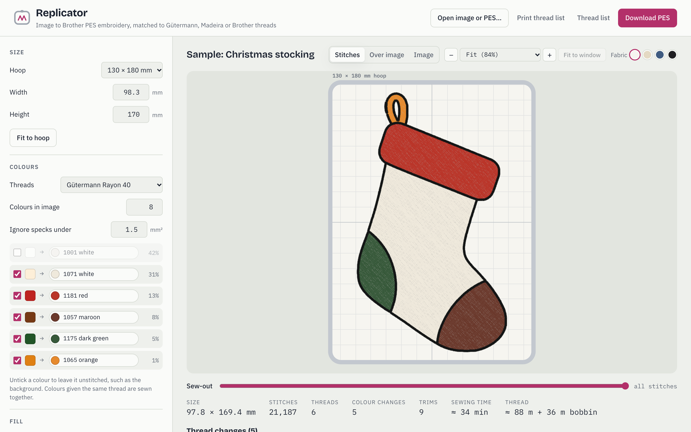
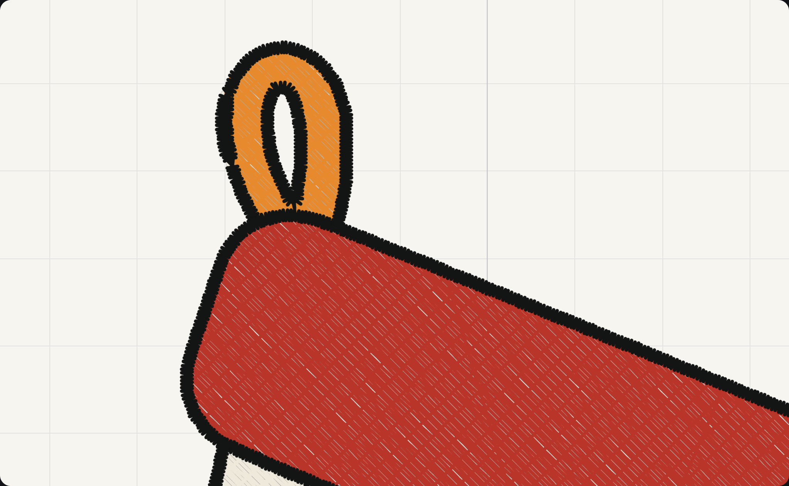
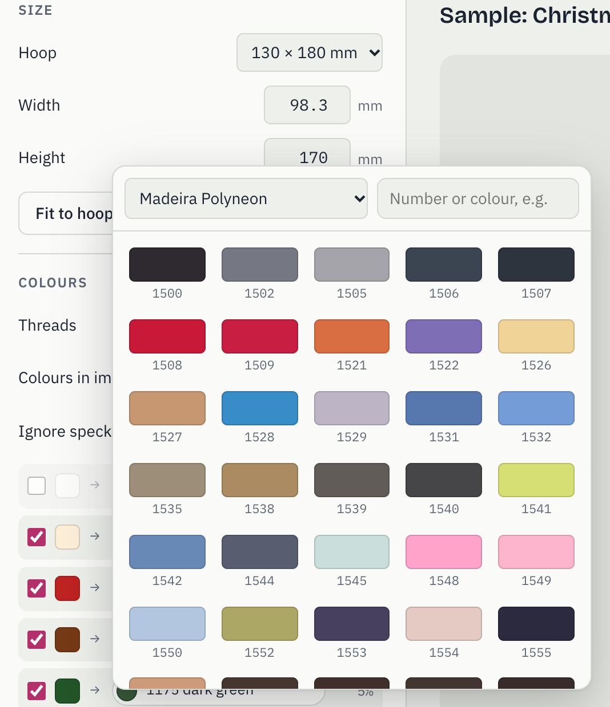
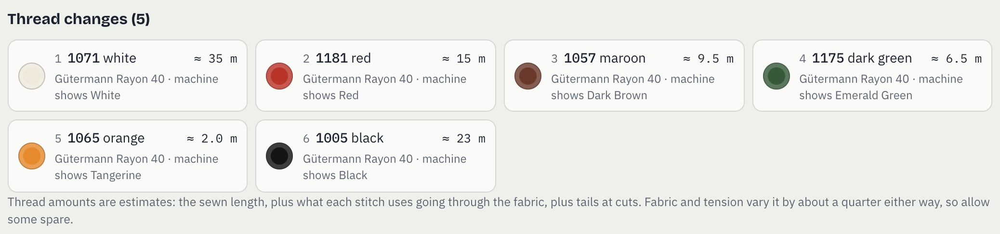
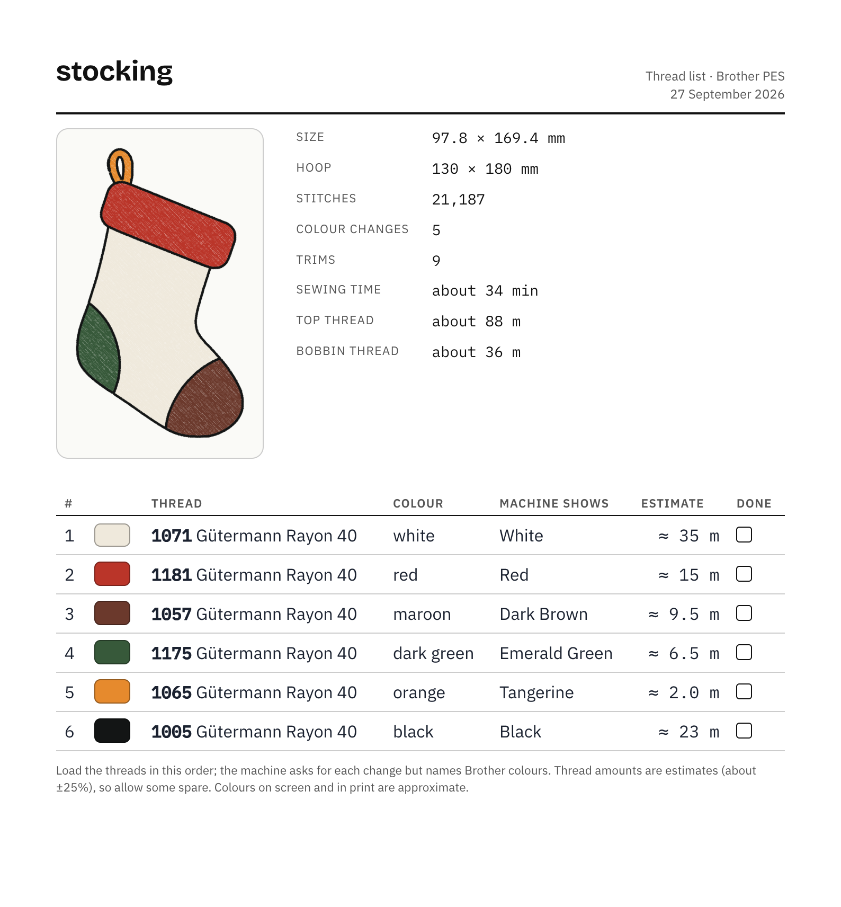
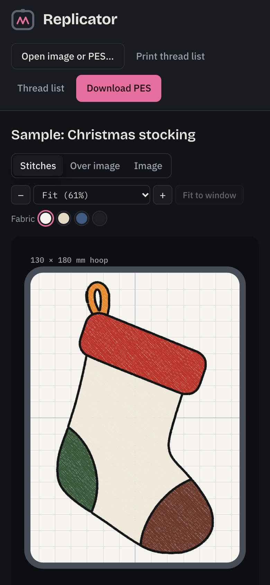

# Replicator

Turn an image into a Brother **PES** embroidery file, ready to sew on machines such as the Brother Innov-is 750E.
Colours are matched to real thread ranges from Gütermann, Madeira or Brother, and you get an estimate of how much of
each thread you'll need.

It's a single web page that runs entirely in your browser, so images never leave your computer. There's no server,
no account and no build step.

<picture>
  <source media="(prefers-color-scheme: dark)" srcset="docs/images/app-dark.png">
  
</picture>

## What it does

1. **Open an image** (PNG, JPEG, HEIC… or paste one). A plain border is cropped off, so the size you set is the
   size of the design.
2. **Choose a hoop and size.** 100 × 100, 130 × 180, 160 × 260 or 180 × 300 mm.
3. **Pick the colours.** The image is reduced to a few colours, each matched to the nearest thread. Untick any you
   don't want sewn, such as the background.
4. **Check the preview**, on the fabric colour you're using, zoomed from 25% to 400% of actual size. The sew-out
   slider replays the stitching in order.
5. **Download the PES file**, plus a thread list, and sew.

You can also open an existing `.pes` file to preview it.

### Stitching



- **Fill:** larger areas get a tatami (brick pattern) fill, with a sparse underlay to hold the fabric.
- **Satin:** areas narrower than a set width, such as lines, lettering and thin borders, are sewn as smooth satin
  columns along their centre line. They sew after the areas they touch, so they sit on top.
- **Outlines:** none, running stitch or satin; in each area's own thread, or all in one thread (such as black) sewn
  last.
- **Sewing order:** *Fewest colour changes* loads each thread once, ordered so details inside other areas still sew
  on top of them. *Best layering* sews back to front, which can mean going back to a thread (red → yellow → red).
- **Tidy stitching:** travel between parts of an area is hidden inside the area where possible; otherwise the thread
  is trimmed, with lock stitches either side.

### Threads



Colours are matched with CIEDE2000, a measure of how different two colours look. Choose the range you're sewing with;
if you have a mixed collection, any single colour can be swapped for a thread from another range, and it stays put
when you change the main range.

| Range | Shades |
| --- | --- |
| Gütermann Rayon 40 | 140 |
| Gütermann Super Brite 40 | 192 |
| Madeira Classic (30/40/60) | 387 |
| Madeira Polyneon | 410, including fluorescents |
| Madeira Sensa Green | 144 |
| Madeira Polyocean | 15 |
| Brother | 64 |

Colours were sampled from the makers' shade cards and checked against the cards' printed indexes. Multicolour,
variegated and metallic threads are left out. Screen colours of thread are approximate.

<br clear="right">

### Thread amounts and a printable list



Each thread gets an estimate of how much you'll use: the exact sewn length, plus about 2.4 mm per stitch for the
trip through the fabric, plus a tail at each cut. That puts professionally digitized designs at about 5 m per 1,000
stitches, the usual rule of thumb. Fabric and tension vary it by about a quarter either way, so allow some spare.

A PES file can only name Brother's 64 colours, so your machine will show Brother names at each colour change. Every
download comes with a thread list giving the real thread numbers, and **Print thread list** makes a one-page sheet
to keep by the machine:



### On a phone



The layout works down to phone width, in light or dark mode, with pinch to zoom.

## Running it

The app is static files in [`web/`](web/). Browsers only run its JavaScript modules and background worker when the
page comes from a web server (not straight from disk), so serve the folder:

```
python3 -m http.server 8765 --directory web
```

Then open http://localhost:8765. To host it, put the `web/` folder on any static host: GitHub Pages, Netlify,
Cloudflare Pages, S3 or your own web server.

## Development

```
cd web/tools
node roundtrip-test.mjs path/to/*.pes                  # stitch data must round-trip exactly (thumbnails may differ)
python3 prep-image.py image.png 100 /tmp/img           # resize an image to 100 mm wide (needs Pillow)
node engine-test.mjs /tmp/img out.pes outlineStyle=satin
node screenshots.mjs                                   # regenerate the images in docs/images (needs Google Chrome)
```

The PES format, as worked out from Brother-generated files, is described in [`docs/pes-format.md`](docs/pes-format.md).

## Licence

[GNU General Public License v3.0](LICENSE).
